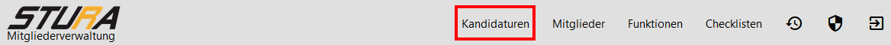
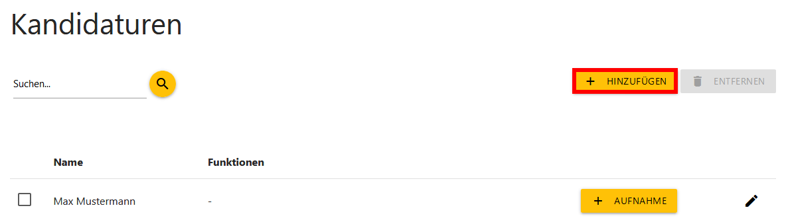
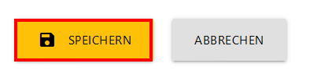
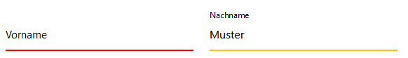
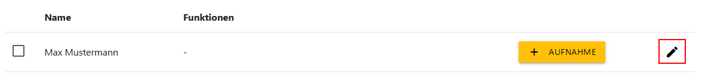
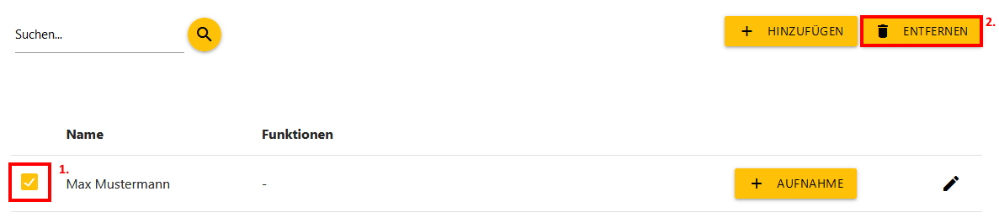
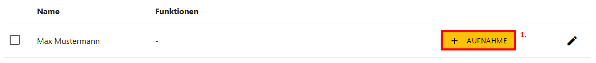
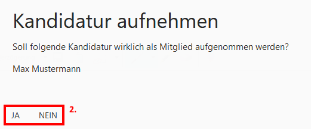
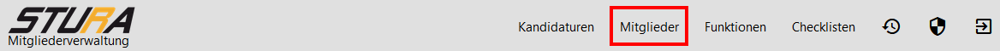

= Anwenderdokumentation (SAd)

== Einführung

=== Zweck

Die bestehende Anwendung ist in der Lage Mitglieder des Studentenrates (Stura) der HTW Dresden zu verwalten. Dies beinhaltet das Erstellen eines neuen Mitgliederdatensatzes in der Datenbank, das Bearbeiten und Löschen über eine leicht bedienbare Weboberfläche, die von der Software bereitgestellt wird. +
Jene ersetzt die unübersichtliche Arbeit mit verschiedenen Exeltabellen, welche vorher vom Admin für die Verwaltung genutzt worden sind und reduziert den allgemeinen Zeitaufwand zum Einpflegen neuer Mitgliederdaten.

=== Funktionsumfang

Durch die Weiterentwicklung des Projektes durch unser Team im Rahmen des Modules Software Engineering I/II wurde das bereits vorhandene System um weitere nützliche Funktionen ergänzt, welche vom Auftraggeber erbeten wurden. +
Neben der Aufnahme von Mitgliedern in die datenbank ist die bearbeitete Anwendung nun auch in der Lage Kandidaturen anzulegen, zu bearbeiten oder zu löschen. +
Als Student der HTW Dresden hat man das Recht,  sich auf eine Funktion im Stura zu bewerben und sich damit als Kandidat für dieses Amt zur Wahl aufstellen zu lassen. +
Um nicht den Überblick über all diese Kandidaturen zu verlieren, war es dem Stura ein Anliegen jene ebenfalls übersichtlicher verwalten zu können, welches durch die aktuelle Software getan werden kann. 

== Nutzung als Admin

* als Admin besitzt man uneingeschränkten Zugriff auf die Anwendung
* der Admin steht es frei die Anwendung auch als normaler User zu nutzen

=== Vorbedingungen

* stabile Internetverbindung
* der Admin muss angemeldet sein

=== Use-Case 01: Kandidaten verwalten

* der Tab "Kandidaturen" muss ausgewählt worden sein

==== Kandidatur anlegen

Um eine neue Kandidatur anzulegen, muss zuerst der Button "*HINZUFÜGEN*" betätigt werden, welcher sich über der Übersicht befindet, die die bereits bestehenden Kandidaturen listet. +

Daraufhin erscheint eine leere Eingabemaske, in die die Daten des Kandidaten eingetragen werden können. Zum Abschließen des Vorgangs muss der Button mit der Aufschrift "*SPEICHERN*" geclickt werden. +

Daraufhin schließt sich die Maske und der neu erstellte Kandidat sollte in der Übersicht angezeigt werden. +

Sollten nicht alle benötigten Daten angegeben worden sein, schlägt die Abspeicherung fehl und der Admin wird auf die fehlende Information aufmerksam gemacht. +

==== Kandidatur bearbeiten

Um eine bereits bestehende Kandidatur zu bearbeiten, muss diese, entwerder mit Hilfe des Suchfeldes oder händisch, aus der Übersicht rausgesucht werden, welche alle Kandidaten listet. Anschließend betätigt man das *Stift*-Symbol am Ende der Zeile, in der ein Teil der Daten des Kandidaten angezeigt werden. +

Daraufhin öffnet sich die gefüllte Eingabemaske und Änderungen an den eingetragenen Daten können vorgenommen werden. Sind diese abgeschlossen, müssen sie gespeichert werden. Dies geschieht über die Nutzung des Buttons mit der Aufschrift "*SPEICHERN*", welcher sich am Ende der Seite befindet.

==== Kandidatur löschen

Um eine bestehende Kandidatur zu löschen, muss diese zuerst rausgesucht werden (siehe "Kandidatur bearbeiten"). Anschließend wird die Kandidatur über die *Checkbox* am Beginn der Zeile ausgewählt. Daraufhin aktiviert sich der "ENTFERNEN" Button, welcher sich oberhalb der Übersicht neben dem "HINZUFÜGEN"-Button befindet. Mit der Bestätigung des "*ENTFERNEN*" Buttons, wird der Datensatz der ausgewählten Kandidatur aus der Übersicht und somit auch aus der Datenbank entfernt. Dem Benutzer wird eine entsprechende Meldung ausgegeben. +

=== Use-Case 02: Mitglieder aufnehmen 

* der Tab "Kandidaturen" muss ausgewählt worden sein

Um ein Kandidat als Mitglied aufzunehmen, nachdem dieser bei einer Wahl erfolgreich gewählt worden ist, muss dieser zuerst aus der Kandidaturen-Übersicht rausgesucht werden (siehe "Kandidatur bearbeiten"). Anschließend kann der "*AUFNAHME*"-Button betätigt werden, woraufhin sich ein Dialogfenster öffnet. Um den Kandidaten wirklich als Mitglied aufzunehmen, muss "*JA*" ausgewählt werden, sonst "*NEIN*". 

=== Use-Case 03: Mitgliederinformationen einpflegen

* der Tab "Mitglieder" muss ausgewählt worden sein

Um weitere Informationen zu einem neuen Mitglied hinzuzufügen, muss dieses aus der Übersicht rausgesucht und das *Stift*-Symbol am Ende der Zeile angeklickt werden. Daraufhin öffnet sich eine Eingabemaske in der weitere Daten zum Mitglied eingetragen werden können. Ist dieser Vorgang abgeschlossen, werden die Daten nach Betätigung des "*SPEICHERN*"-Buttons in die Datenbank übernommen. 

== Nutzung als User

* als User besitzt man eingeschränkten Zugriff auf die Anwendung

=== Vorbedingungen

* stabile Internetverbindung
* der User muss angemeldet sein

=== Use-Case 04: Mitglieder per E-Mail kontaktieren

* der Tab "Mitglieder" muss ausgewählt worden sein

==== Indirekte Kontaktierung

Für eine indirekte Kontaktierung muss das zu kontaktierende Mitglied in der jeweiligen Übersicht rausgesucht werden. Neben dem Namen und den Funktionen kann der User auch die Mail-Adresse einsehen und sie dazu verwenden eine E-Mail an das jeweilige Mitglied zu adressieren.

==== Direkte Kontaktierung

Für eine direkte Kontaktierung muss das zu kontaktierende Mitglied in der jeweiligen Übersicht rausgesucht werden. Am Ende der Datenzeile kann der User auf das Mail-Icon clicken, woraufhin sich das Mailprogramm Thunderbird öffnet, welches die Mail-Adresse schon in der Empfängerzeile enthält.

== Allgemeine Hinweise

* Hinweise über den Erfolg einer Anlegung/Löschung werden textuell ausgegeben
* rot unterstrichene Felder sind ein Zeichen dafür, dass noch nicht alle benötigten Eingaben getätigt worden sind

