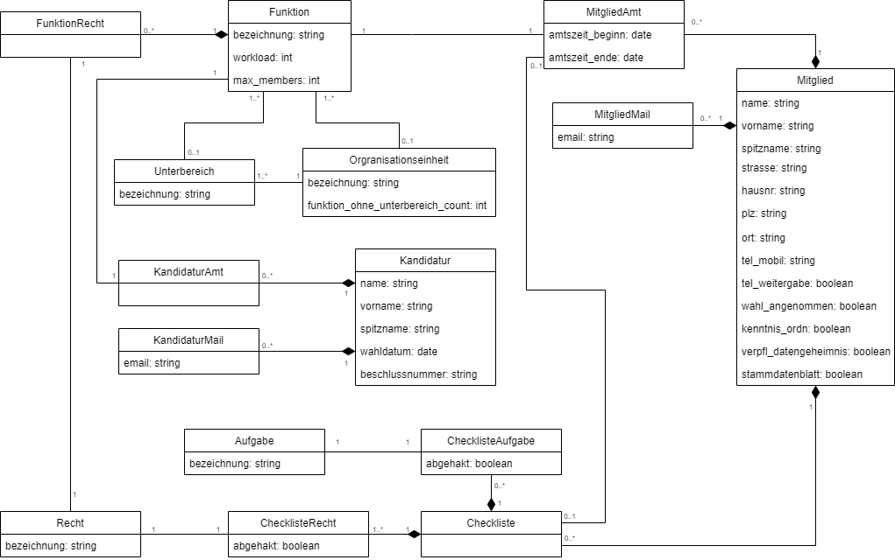

= Entwurfsdokumentation

Dieses Dokument beschreibt wesentliche  Elemente der Softwarearchitektur, sowie andere übergreifende Aspekte des Systems für die Mitgliederdatenbank des StuRa. Hier wird im Folgenden auf die Ziele, Annahmen, die architektonische Bedeutung, unsere Entscheidungen bzw. Einschränkungen und weitere Dinge eingegangen und dokumentiert.

Mit Hilfe von verschiedenen Modellen und Entwürfen für die Architektur, soll die spätere Weiterentwicklung und Anpassung einfacher gemacht werden.

== Architektonische Ziele und Philosophie

Das System ist eine Webanwendung zur Verwaltung der Kandidaten und Mitglieder des Stura der HTW Dresden durch einen Admin. Offizielle Mitglieder erhalten über einen Login Zugang zur Anwendung und können verschiedene Informationen einsehen, aus diesem Grund muss eine parallele Nutzung von 5 Personen gewährleistet werden (lesend). Des Weiteren ist nicht bekannt auf welchem Endgerät die Nutzung der Anwendung erfolgen wird, weshalb auf die Kompatibilität des Inhaltes mit deren Ansicht auf diversen Bildschirmgrößen geachtet werden muss. +

Eine gute Bedienbarkeit wird durch eine übersichtliche und intuitive Benutzeroberfläche erzielt, welche zur Akzeptanz des Gesamtsystems durch die Mitglieder und des Admin beiträgt. +

Das System soll auf einem Linux-Webserver eingerichtet werden, der ausreichende Ressourcen zur Verfügung stellt.

Die Anwendung ist eine weiterentwickelte Version des Projektes der Gruppe, von der wir das System übernommen haben. Andere Gruppen, aus zukünftigen Semestern, werden vermutlich ebenfalls an der Optimierung dieser Mitgliederdatenbank arbeiten, sodass das System einfach erweiterbar sein soll.

== Annahmen und Abhängigkeiten

.*Annahmen*

* Jeder Nutzer hat eine stabile Internetverbindung und nutzt einen aktuellen Browser (Firefox oder Chrome).
* Der Server auf dem die Webseite laufen soll, bietet ausreichende Ressourcen:
** Arbeitsspeicher: Verbund aus 3 Servern mit jeweils 72 GB RAM
** Massenspeicher: ausreichend groß
** Betriebssystem: Linux
* Die bisher verwendeten Datenbankmodelle und Frameworks können weiter verwendet werden.
* Die Mitgliederdatenbank wird in Zukunft funktional erweitert.
* Das Django-Framework gibt bereits eine Aufbau-Architektur vor.

.*Abhängigkeiten*
* Wir sind vom Laborbereich abhängig, der den Server mit seinen Ressourcen stellt.

== Architektur-relevante Anforderungen
[cols="1,4,4"]
|===
| *Anforderung* | *Systemkomponente* | *Architekturmechanismen*

| F1 | Webanwendung | Zugriffsschutz
| F2 | Datenbank | Persistenz
| R1 | Webanwendung +
Datenbank | Archivierung
| S1 | Webanwendung | Dokumentation

|===

== Entscheidungen, Einschränkungen und Begründungen

. Wir nutzen *Python als Programmiersprache*, da die bestehenden Teile der Anwendung in dieser Sprache programmiert wurden und wir einen Mehraufwand im Sinne einer Umstrukturierung vermeiden wollten. +
Außerdem ist sie objektorientiert und besitzt eine verhältnismäßig leichte Syntax.
. Ebenso wie unsere Vorgänger nutzen wir *Django als Framework*. Es ist ebenfalls in Python verfasst und folgt einem Model-View-Template-Schema, aus dem eine leichte Erweiterbarkeit resultiert.
. *SQLite wird als Datenbanksystem* aufgegriffen, da es standartmäßig von Django unterstützt wird und von der Syntax sehr dem SQL-Standard ähnelt, mit dem einige Gruppenmitglieder schon intensiveren Kontakt hatten. +
Abgesehen davon ist SQLite mit verschiedenen Betriebssystemen kompatibel und unterstützt so das Erreichen von mehr Nutzern, die sich durch ihre verschiedenen Voraussetzungen auszeichnen.
. Ebenso verwenden wir *Django-Simple-History und simplejson* weiter, da diese bereits von der Vorgängergruppe verwendet wurden und die bestehende Funktionalität diese nutzt.
. Im Gegensatz zur Vorgängergruppe entscheiden wir uns dagegen, das Framework Selenium im Zusammenhang mit den Tests zu verwenden, da hierbei der Einarbeitungsaufwand unverhältnismäßig groß wäre, da kein Mitglied unseres Teams damit bis jetzt in Kontakt gekommen ist. Die Tests werden stattdessen manuell durchgeführt.

== Architekturmechanismen

.*Archivierung*
** Zustand: Analysis
** Zweck: Daten dürfen bei Systemausfällen nicht verloren gehen
** Eigenschaften/ Attribute: Pro Woche soll ein Backup erstellt werden. Es sollen nie mehr als 3 Backups vorhanden sein
** Funktion: Backup der Datenbank wird auf dem Server angelegt

.*Dokumentation*
** Zustand: Implementation
** Zweck: Die Anwendung soll erweiterbar sein/bleiben
** Eigenschaften/ Attribute: verständlich
** Funktion: Framework Django wird verwendet. Dokumentationen werden angefertigt

.*Persistenz*
** Zustand: Implementation
** Zweck: Daten müssen verfügbar bleiben für den Admin und die Mitglieder des Stura
** Eigenschaften/ Attribute: SQLite-Datenbank
** Funktion: Alle zu speichernden Daten müssen Platz in der Datenbank finden

.*Zugriffsschutz*
** Zustand: Implementation
** Zweck: Login
** Eigenschaften/ Attribute: Nicht jeder Nutzer ist dazu berechtigt alle daten einzusehen
** Funktion: Unterscheidung beim Login nach Mitglied Stura und Admin

=== Datenspeicherung

Die Speicherung der Daten erfolg über die SQLite-Datenbank. Jeder Datensatz ist identifizierbar über einen Primärschlüssel in Form einer ID.

=== Webschnittstelle

Die von Django bereitgestellte Schnittstelle wird verwendet um Daten über die Webseite zu organisieren und zu verwalten.
Die Weboberfläche wurde mittels HTML/CSS erstellt.

=== Informationsvermittlung

Bereitstellung der Daten für Organisations- und Informationszwecke auf der Webseite

== Systemarchitektur

:!figure-caption:

=== Architekturmuster

.Model-View-Template (MVP)
* wird von Django Framework bereitgestellt
* *Model:* ist für Zugriff auf die Datenbank zuständig, liest und schreibt Daten
* *View* (Ansicht)*:* für Verarbeitung der Daten verantwortlich
* *Template:* Leere HTML-Seite, die durch View mit Daten gefüllt wird

{empty} +
{empty} +

=== Logische Sicht

==== C4 Modelle

.Level 1

{empty} +
{empty} +

.Level 2

{empty} +
{empty} +

.Level 3

{empty} +
{empty} +

.Legende

{empty} +
{empty} +

==== Klassendiagramm

.Klassendiagramm

{empty} +
{empty} +

==== Paketdiagramm

.Paketdiagramm mit Klassen

{empty} +
{empty} +

=== Ablaufsicht

==== Sequenzdiagramme

.UC01: Kandidat hinzufügen
image::ED-images/Sequenzdiagramm_Kandidat_hinzufügen_UC01.png[Sequenzdiagramm UC01]

{empty} +
{empty} +

.UC02: Kandidat aufnehmen

{empty} +
{empty} +

=== Szenarien

==== Aktivitätsdiagramme

.UC01: Kandidat hinzufügen
image::ED-images/Aktivitätsdiagramm_Kandidat_hinzufügen_UC01.png[Aktivitätsdiagramm UC01]

{empty} +
{empty} +

.UC02: Kandidat aufnehmen
image::ED-images/Aktivitätsdiagramm_Kandidat_zu_Mitglied_UC02.png[Aktivitätsdiagramm UC02]

image::ED-images/Legende_Aktivitätsdiagramm.png[Aktivitätsdiagramm Legende]