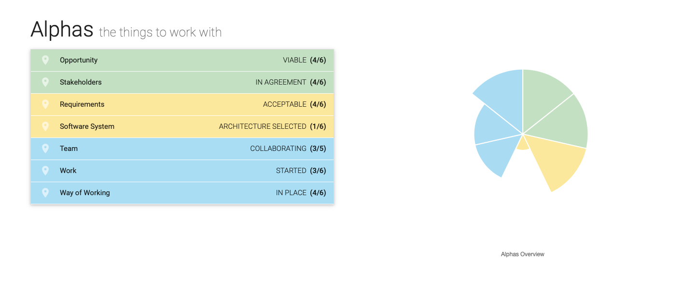
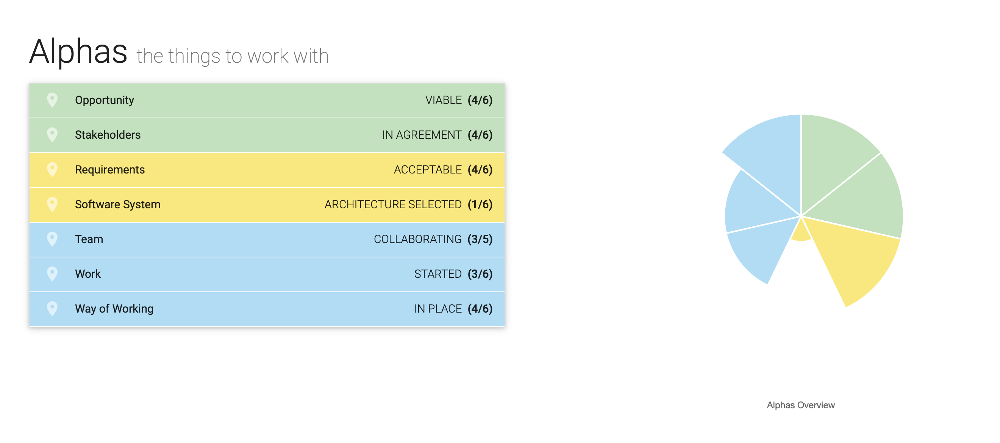
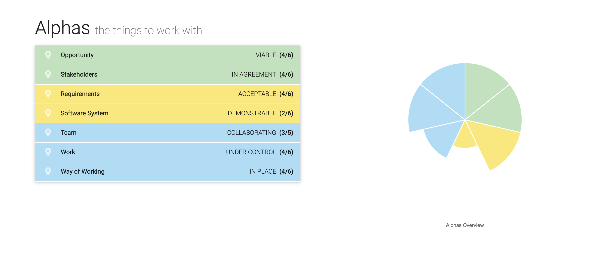
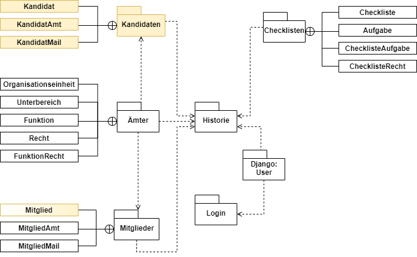
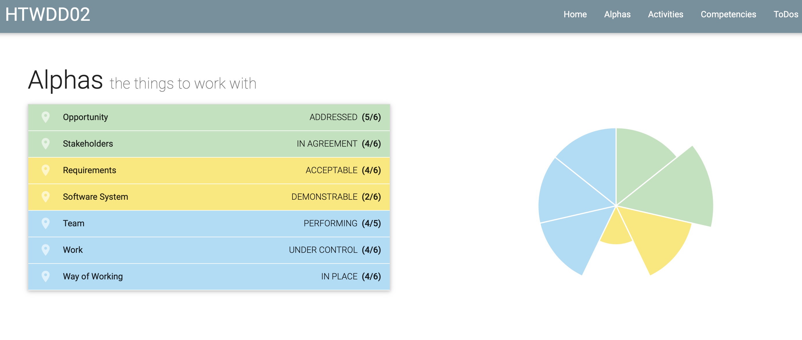
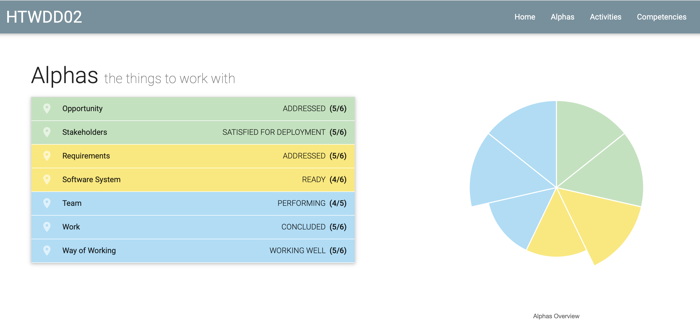
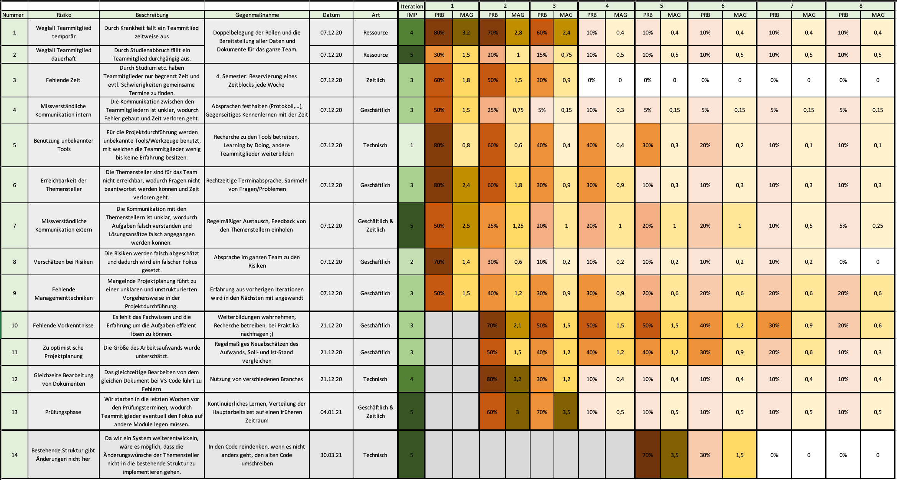

= Durchführung (SAd/MZi)
//Manuela Ziesche <manuela.ziesche@htw-dresden.de>
//{localdatetime}
:toc: 
:toc-title: Inhaltsverzeichnis
:source-highlighter: highlightjs

== Inception Phase
=== Iteration 01: Anforderungsanalyse (SAd)

Die Inception Phase startete im Wintersemester 2020 mit unserer kleinen, aber informativen Kennlernrunde, die wir im ersten Meeting durchführten. Nachdem wir uns von unseren zukünftigen Teamkollegen ein Bild gemacht haben, wurden die im Unified Process beschriebenen Rollen nach Wunsch aufgeteilt.

Im weiteren Verlauf der Phase haben wir uns zunächst mit dem bestehenden Software System beschäftigt, welches unserem Projekt als Grundlage dienen sollte. Dazu nahmen wir Kontakt mit der Vorgängergruppe auf und erhielten die Zugangsdaten, mit deren Hilfe wir uns selbst einen Überblick über bestehende Funktionalitäten schaffen konnten. Wir erhielten außerdem Einblick in die angefertigten Dokumentationen, sowie eine kurze Einführung in den Quellcode von einem ursprünglichen Entwickler.

Als nächstes vereinbarten wir ein Meeting mit der Auftraggeberin Sophia von Asow. Dies erwies sich als etwas schwierig, da diese leider eine Woche lang nicht auf unsere E-Mail reagierte. +
Neben den in der Aufgabenstellung festgelegten Einschränkungen erfuhren wir in der nächsten Konferenz mit ihr mehr über wichtige Anforderungen, die sie als Vertretung für den Student:innenrat an das System stellte. Jene wurden sowohl textuell in einem Gesprächsprotokoll, als auch in der Vison festgehalten und sollten die Basis des neuen Systemabschnittes bilden.

== Elaboration Phase
=== Iteration 02: Use-Cases und Architektur (SAd)

Ziel dieser Iteration war es, aus den gestellten Anforderungen Use Cases zu formulieren, welche uns eine Aussicht auf zu implementierende Funktionen gaben.

Parallel wurde das System lokal anhand der Einrichtungshinweise in der Dokumentation in Betrieb genommen und der Quellcode analysiert. Zwar hatte keines der Teammitglieder Erfahrungen im Umgang mit der Programmiersprache Python gesammelt, doch wir haben uns dennoch dazu entschieden, das System in dieser Sprache zu erweitern. Aufgrund der Menge an Quelltext schien es uns aufwendiger die bestehende Anwendung in einer uns bekannten Programmiersprache zu realisieren, als jene zu erlernen, in der es programmiert wurde.

Außerdem wurde begonnen das Architecture Notebook zu erstellen.

=== Iteration 03: Architektur (SAd, LVS)

Das Hauptaugenmerk in dieser Iteration lag auf der weiteren Ausarbeitung der Use Cases und der Architektur durch die Analysten und Architekten. Aussagekräftige Wireframes wurden erstellt. Diese wurden auch gleich unseren Themenstellern präsentiert und von ihnen gut angenommen. Es gab einige Vorschläge für Anpassungen, welche wir auch gleich übernommen haben. So hat sich beispielsweise herausgestellt, dass der Admin die zusätzlichen Informationen für neu aufgenommene Mitglieder lieber erst einpflegen möchte, NACHDEM die Kandidatur bereits als Mitglied aufgenommen wurde.

== Construction Phase
=== Iteration 04: Anforderungen formal anpassen (SAd)

Mit dieser Iteration starteten wir nicht nur in die Construction Phase, sondern auch in das neue Semester, welches einen in den Stundenplan eingetragenen Slot zum Arbeiten mit sich brachte. Dieser ergänzte die wöchentlichen Meetings, in der die jeweiligen Wochen geplant und Aufgaben besprochen wurden.

Der genutzte Discord-Server wurde um weitere Sprachkanäle erweitert, die es erlaubten themenbezogen in kleineren Gruppen zu arbeiten, was die Produktivität steigerte.

In den ersten Wochen nach Semesterbeginn fand eine Konsultation zu dem abgegebenen Beleg aus Software Engineering I statt. Diese hat uns mehrere Defizite in unserer Arbeit erkennen lassen, die wir in den kommenden Wochen ausbessern wollten.
Dazu zählte unter anderem der Zustand des Architecture Notebook und die Ausformulierungen der Use Cases.

Allgemeine Fragen, die sich in diesem Zusammenhang ergaben, konnten ab dieser Iteration außerordentlich gut geklärt werden, da die Projektmanagerin Manuela Ziesche nun selbst Mitglied im StuRa war. Des Weiteren kamen wir durch unsere Auftraggeberin in Kontakt mit Axel Schiller, dem zukünftigen Admin der gesamten Anwendung. Dieser erklärte sich bereit, ebenfalls die Rolle eines Ansprechpartners einzunehmen, was die Klärung von Fragen enorm verbesserte. Die Aufgaben, die unser System übernehmen sollte, werden zur Zeit mit Hilfe von Excellisten ausgeführt, welche manuell von Axel bearbeitet werden. Aus dieser Position heraus konnte er uns wertvolle Umsetzungsvorschläge und sehr gutes Feedback zu unseren entwickelten Wireframes geben, die wir ihm und Sophia präsentiert haben.

Zusammengefasst nutzen wir diese Iteration hauptsächlich für die Überarbeitung des Beleges aus dem Wintersemester 20/21 um das weitere Arbeiten zu erleichtern. Diese Iteration haben wir am Ende als Team zusammen bewertet. Unsere Kriterien dafür waren, dass wir unsere Aufgaben und Ziele durchsprechen und uns notieren, was wir erledigt oder erreicht haben. Da wir in dieser Iteration leider noch nicht angefangen hatten, den Prototypen zu entwickeln und außerdem nicht so weit mit den Test Cases fortgeschritten waren, haben wir uns selber den gelben Projektstatus gegeben. Das wollten wir in der nächsten Iteration ändern und uns da wieder den Status 'grün' geben. 

Am Ende jeder Iteration bei dem Assessment der jeweiligen Zeit, beschäftigten wir uns mit dem Essence Navigator. An diesen eingefügten Bildern sieht man deutlich, dass wir kleine, stetige Schritte in jeder Iteration gingen.

=== Iteration 05: Prototypen (MZi)

In die fünfte Iteration starteten wir noch mit einigen Aufgaben des Beleges aus dem Wintersemester. In der vierten Iteration wurden nicht alle beendet, welche wir uns nun vorgenommen hatten. Außerdem hat uns das Meeting mit unserem Coach Felix Müller am Anfang der Iteration sehr viel positiven Input gebracht, wodurch wir dann die Anforderungsspezifikation und vorallem die Architektur noch einmal überarbeiten konnten. Wir wollten uns Ziele setzen, die uns in dieser Iteration effektiv weiter voranbringen würden. Deswegen haben wir uns dazu entschieden erst einmal an den Test Cases weiter zu arbeiten, was uns sehr wichtig erschien. Unser Entwickler, Vasco Schwarze, begann mit der Implementierung des Prototypen des ersten Use Cases, damit wir uns erstes Feedback von den Stakeholdern einholen konnten. 

Das Gespräch mit Axel Schiller und Sophia von Asow zur Präsentation des derzeitigen Standes lief super. Wir haben noch einige Verbesserungsvorschläge bekommen, welche wir direkt mit aufgenommen haben, da diese keinen großen Aufwand nach sich zogen.
Im Laufe des Gespräches haben wir auch erfahren, dass beide sehr glücklich sind bei dem Projekt dabei zu sein und Ihnen unsere bisher geleistete Arbeit gefällt.

Die gesetzten Ziele hatten wir alle erreicht. Dazu muss man aber sagen, dass wir diese Iteration nicht ganz so stark mit Aufgaben gefüllt hatten, da wir uns hauptsächlich erneut auf die Nachbereitung des Beleges konzentriert hatten. Die einzige Aufgabe, die wir noch mit in die nächste Iteration nehmen wollten, war es, die Diagramme des C4 Modells in das Architecture Notebook einzupflegen, da dieses sonst soweit fertig war. Am Ende der Iteration haben wir uns wieder alle über Discord getroffen und über unsere Erfolge oder Misserfolge gesprochen. Wir waren uns einig, dass wir unserem Projekt einen grünen Status geben können, da wir alle in der Iteration notwendigen Aufgaben sorgfältig erledigt haben. Auch ein kleiner Prototyp der Erweiterung war von unserem Entwickler fertiggestellt worden. Damit haben wir auch ein Ziel erreicht, was wir uns vorgenommen hatten:  ein grüner Projektstatus. 

=== Iteration 06: Implementation (MZi, LVS)

Mit der sechsten Iteration kamen nun auch endlich die ganzen Aufgaben, die wir zur effektiven Weiterbearbeitung des Projektes erledigen wollten. Das Ziel in dieser Zeit war es, die Use Cases 1 und 2 zu implementieren. Außerdem wollten wir anfangen uns mit den Dokumentationen zu beschäftigen, damit wir am Ende der 8. Iteration nicht zu viel Stress haben und entspannt alles beenden und abgeben können. 

Wir hatten uns bei der Nachbearbeitung des Beleges schon eine Prioritätsliste angelegt, welche Use Cases wir zuerst entwickeln wollen, wobei wir auch unsere Themensteller in die Priorisierung mit einbezogen. Danach hat sich auch die Abarbeitung jener gerichtet. Da wir die Use Cases schon am Anfang des Projektes nummeriert hatten und Use Case 1 auch die höchste Priorität hatte, fingen wir mit diesem an und wollten uns nach unten (Priorisierung) durcharbeiten. Wir wussten aber schon zu diesem Zeitpunkt, dass wir es nicht schaffen werden, alle Use Cases zu implementieren. Auch das haben wir mit unseren Themenstellern besprochen, welche dafür Verständnis zeigten. Sie hatten selber bereits vermutet, dass eine komplette Umsetzung aller Anforderungen unsere Möglichkeiten übersteigt.

In dieser Iteration hatten wir auch ein Meeting mit unserem Coach Felix Müller. Hier ging es vorrangig um die Frage, wie wir unsere Use Cases testen wollen. Er hat uns empfohlen, dass wir einfach manuell testen sollen und unsere Stakeholder dann noch Akzeptanztests durchführen sollen, welche wir vorher vorbereiten mussten. Hierfür wurde von Sabine ein grober Ablaufplan erstellt, welcher den Stakeholdern während des selbständigen Testens als Leitfaden dienen sollte. Doch durch krankheitsbedingte Abwesenheit von Axel Schiller, dem späteren Admin des Systems, mussten wir diesen Akzeptanztest in die nächste Iteration verschieben.

In dem Meeting mit Felix hatten wurde auch erstmalig angesprochen, dass sich ein Teammitglied nicht so sinnvoll in das Projekt einbringt, wie notwendig wäre. Er gab uns Ideen, wie wir damit umgehen und was wir im schlimmsten Falle tun sollten. Wir klärten diese Vorgehensweise untereinander im Team, ohne den jeweiligen Betroffenen, und gaben ihm weitere Chancen, Aufgaben zu übernehmen und sich sinnvoll ins Team einzubringen. 

Die Implementierung ging sehr gut voran. Unser Entwickler beendete den Kandidatentab in dieser Iteration, welcher den Use Case 1 widerspiegelte. Außerdem fing er an, den Use Case 2 zu implementieren, wodurch man mit dem System einen Kandidaten per Knopfdruck als Mitglied aufnehmen konnte.

Bei den Dokumentationen tat sich am Ende der Iteration auch etwas. Sabine Adam fing mit der Anwenderdokumentation an und Manuela Ziesche widmete sich dem Projektbericht. Wir schrieben noch nicht allzu viel, jedoch fingen wir an, uns mit den Dokumentationen zu beschäftigen und erste Ideen zu sammeln.

Am Ende der Iteration 6 traf sich das Team noch einmal, um die Test Cases des ersten Use Cases durchzutesten, damit wir erfolgreich weiter implementieren und notfalls noch Änderungen vornehmen konnten. Am letzten Tag der laufenden Phase fanden sich erneut alle Teammitglieder ein, um die beendete Iteration zu bewerten und erfolgreich abzuschließen. Dazu verglichen wir die geplanten Aufgaben und die Erledigten. Durch die sehr gute Aufgabenerfüllung der Teammitglieder war es uns nun erneut möglich, einen grünen Projektstatus zu erteilen.

=== Iteration 07: Tests (MZi, LVS)

Die vorletzte Iteration des Projektes wurde von der Implementierung der restlich geplanten Use Cases geprägt. Diese wollten wir soweit abschließen, damit wir uns in der nächsten Iteration auf andere Dinge konzentrieren konnten. Außerdem  haben wir uns vorgenommen, die Dokumentationen annähernd fertigzustellen. Doch die Hauptaufgabe dieser Iteration war es, den Akzeptanztest mit unseren Stakeholdern durchzuführen, damit wir die Entwicklungsphase des Projektes erfolgreich abschließen und uns der Dokumentation und der Präsentation des Systems widmen konnten. 

Das Teammitglied, welches sich sonst zu gering in die Teamarbeit eingebracht hat, wollte seine Notizen zu den Test Cases pushen. Dabei stellten wir jedoch fest, dass er lediglich die Test Cases aus dem Team des letzten Jahres kopiert hatte. Daraufhin beschäftigte sich der zweite Tester, Sebastian Matthäus, nochmal mit dem Thema.

Durch einen erneuten krankheitsbedingten Ausfall von Axel Schiller, wurde der Akzeptanztest wieder um eine Woche nach hinten verschoben. Der Akzeptanztest fanden dann in einem virtuellen Meeting mit den Stakeholdern und weiteren Interessenten vom StuRa statt. Wir hatten uns vorher überlegt, was in diesem Meeting getestet werden soll und dann durften die Stakeholder Axel Schiller und Sophia von Asow das System ausprobieren. Bei diesem Test sind Ihnen noch kleinere Dinge aufgefallen, die wir verändern sollten. Diese hat unser Entwickler Vasco Schwarze direkt noch umgesetzt. Zusammenfassend waren die Tests sehr erfolgreich und für die Stakeholder zufriedenstellend. 

Nach diesem Meeting waren wir mit der Implementierung unseres Systems so gut wie fertig. Jetzt ging es (neben einigen letzten Tests) nur noch darum, dass wir die Dokumentationen, den Projektbericht und die Reflexionen anfertigen mussten. Dazu haben wir diese untereinander ziemlich gut aufgeteilt. 

Außerdem beendete unser Architekt Benjamin in dieser Iteration alle Diagramme, welche in der letzten Zeit nur noch verfeinert wurden. Im folgenden Diagramm ist zu sehen, an welchen Stellen im System wir Änderungen vorgenommen haben bzw. welche Klassen/Pakete wir hinzugefügt haben (gelb). 

Außerdem verglichen wir unsere identifizierten Use Cases mit den tatsächlich umgesetzten. Wir hatten uns ziemlich zeitig schon eine Priorisierung einfallen lassen, wonach wir die Use Cases implementieren wollen. Dadurch haben wir nur diejenigen mit hoher Priorisierung entwickelt und die, welche eine niedrigere hatten, nicht mehr implementiert. Alles in Allem waren wir mit dem Entwicklungsstand zufrieden, wir hatten 4 der 7 Use Cases umgesetzt. Dies entsprach genau unserer Vorstellung zu Beginn des Semesters.

Am Ende dieser Iteration war es nicht nur wichtig, dass das Team die erledigten und geplanten Aufgaben vergleicht. Zusätzlich wollten wir von unseren Stakeholdern eine positive Rückmeldung bei den Akzeptanztests erhalten. Da das Feedback positiv ausgefallen war und wir unsere Ziele alle erreicht hatten, entschieden wir uns erneut für einen grünen Projektstatus. 

== Transition Phase

=== Iteration 08: Dokumentation (SAd)

Zuversichtlich starteten wir in die letzte Iteration des Projektes. Das war außerdem auch die Transition Phase unseres Projektes. Die Implementation der Use Cases, die wir uns vorgenommen hatten, war soweit abgeschlossen und konnte nun weiter getestet werden.
Des Weiteren bestand unsere Aufgabe hauptsächlich daraus, die verschiedenen Dokumentationen, die wir in der vergangenen Iteration begonnen hatten und die für den Beleg nötig sind, zu beenden. Der Fachaustausch zum Thema Dokumentation hat uns diesbezüglich noch einige Hinweise geben können, die wir direkt umsetzten konnten.

Die erstellte Anwendungsdokumentation konnte nach Abschluss der Implementation des Use Cases 4, welcher sich mit der Kontaktaufnahme von Mitgliedern per E-Mail befasst, angepasst und beendet werden. Letztendlich gliedert sie sich in zwei größere Abschnitte, die sich zum einen mit den Funktionen beschäftigen, die vom normalen Nutzer verwendet werden können und zum anderen nur vom Admin mit seinen uneingeschränkten Rechten.

Die Entwicklerdokumentation setzt sich aus der Entwurfsdokumentation und der Codedokumentation zusammen. Letztere wurde mit Doxygen automatisch generiert und wird im HTML-Format beigelegt.

Abgesehen von den Dokumentationen stand uns auch noch die Übergabe des Systems an die Auftraggeber bevor. Als Vorbereitung darauf sollte das bereitgestellte Abnahmeprotokoll erstellt werden, welches unter anderem die umgesetzten Anforderungen und Use Cases festhalten soll. Dazu kann letztendlich festgehalten werden, dass sich die wichtigsten Use Cases, bereit zur Nutzung, im System befinden.

In der ersten Woche der letzten Iteration haben wir uns erneut konstruktiv über das Teammitglied ausgetauscht, welches zum jetzigen Zeitpunkt nach mehrmaligem Nachfragen immernoch keine Reflexion angefangen hat. Wir entschieden uns dazu, es doch noch bei Herrn Anke anzusprechen und mit ihm darüber zu reden.

Weiterhin war in der letzten Woche die Präsentation unserer Software fällig. Diese bereitete Vasco Schwarze vor und nach Absprache mit dem Team konnten wir sie auch erfolgreich durchführen.

In der letzten Woche haben wir es auch direkt geschafft, das Abnahmegespräch mit unseren Stakeholdern abzuhalten. Diese waren sehr glücklich mit dem Ergebnis. Wir bekamen ein positives Feedback zu unserer Arbeitsweise, da wir trotz unserer (zahlenmäßig) gering gehaltenen Meetings für Sophia und Axel transparent gearbeitet haben. 
Nach Meetings mit unseren Auftraggebern haben wir ziemlich selbstständig gearbeitet und wenn nötig nach Rat oder Feedback gefragt, damit wir wussten, dass wir auf dem richtigen Weg sind. +
Das folgende Bild stellt den finalen Stand unseres Projektes im Essence Navigator dar:

== Wesentliche Entscheidungen (LVS)
=== Iterationslängen

Wir haben uns am Anfang des Projektes dafür entschieden, dass wir Iterationslängen von drei Wochen machen möchten. Die Gründe dafür sind ziemlich simpel: Wir müssen pro Iteration zwar mehr planen, haben aber im Großen und Ganzen weniger organisatorische Arbeit, da wir weniger Iterationen planen, abschließen und bewerten mussten. Außerdem war dadaurch genügend Zeit pro Iteration, um die geplanten Ziele zu erreichen. Auch wenn jemand einige anderweitige Verpflichtungen hatte, fand sich innerhalb der drei Wochen somit auf jeden Fall genügend Zeit, die Ziele zu erreichen.

=== Weiterverwendung des bestehenden Systems

Wir entschieden uns, das bestehende System der vorherigen Gruppe weiterzuentwickeln, da es gut und (größtenteils) fehlerfrei funktioniert und den Anforderungen der Themensteller entspricht. Außerdem ist das System durch die Nutzung des Django-Frameworks einfach erweiterbar.

=== Manuelles Testen

Nach einiger Überlegung und in Rücksprache mit unserem Coach, entschieden wir uns, nicht automatisiert, sondern manuell zu Testen. Aufgrund der relativ geringen Anzahl an Tests und des relativ kleinen Umfangs der einzelnen Test Cases, sollte dies auch kein Problem darstellen. Der Einarbeitungsaufwand in das automatisierte Testen wäre für unseren Tester zu hoch gewesen, diese Zeit wollte er lieber mit dem tatsächlichen Entwickeln von Test Cases verbringen. Außerdem bot es sich für die Art unserer Anwendung (Webanwendung) an, die Tests manuell (per Durchklicken) durchzuführen.

== Probleme und Lösungen
=== Kommunikation mit der Auftraggeberin (SAd/MZi)

Gerade während Software Engineering I war die Kommunikation mit einem der Stakeholder ein wiederkehrendes Problem. Zu Beginn des Projektes war Sophia von Asow unsere einzige Ansprechpartnerin, auf die wir stark angewiesen waren. Die Kommunikation an sich fand hauptsächlich per E-Mail statt, doch diese wurden meist deutlich später beantwortet, wodurch sich ein gewisser Zeitverzug ergab (gerade in der Analysephase, in der unsere Analysten viele Fragen hatten).

Doch dieses Problem löste sich, als uns Sophia mit Axel Schiller in Kontakt brachte, welcher in Zukunft als Admin mit unserer Anwendung arbeiten wird. Durch Axel konnten wir Fragen, die sich während des zweiten Teils des Projektes ergaben, deutlich schneller und ausführlicher klären. Da er derjenige ist, der hauptsächlich mit dem System arbeiten wird, war sein konstruktives Feedback in gemeinsamen Meetings von besonders hohem Wert.

Des Weiterem ist Manuela Ziesche seit März 2021 selbst Mitglied im StuRa, wodurch sich einige Fragen, beispielsweise zu internen Prozessen, selbst geklärt haben.

=== Virtuelle Organisation (SAd)
Aufgrund der Corona Pandemie standen persönliche Treffen miteinander im Team außer Frage. Das erschwerte die Arbeit anfangs sehr. Zwar konnte man im vergangenen Semester schon Erfahrungen im Home-Office sammeln, allerdings zumeist nur in Einzelarbeit. Bei diesem Projekt ging es jedoch unter anderem um Teamarbeit, was die Einzelarbeit auf Dauer ausschloss. Als Ersatz für ein reales Treffen nutzten wir Discord um unsere Angelegenheiten in diversen Audiokonferenzen zu besprechen. Für diese war es gerade am Anfang schwer einen gemeinsamen Termin zu finden, da noch kein eingetragener Slot im Stundenplan existierte.

Für die gemeinsame Terminfindung wurde eine WhatsApp-Gruppe verwendet und vereinbarte Termine wurden auf Tello hinterlegt. Neben den Informationen zu unserem nächsten Meeting wurden auch Aufgaben und deren Status auf dem virtuellen Board hinterlegt, was das Arbeiten übersichtlicher gestaltete und erleichterte.

In Summe ergab sich daraus ein belastbares System der 
Kommunikation, das eine solide Basis für das Projekt bildete. Voraussetzung dafür war nur eine stabile Internetverbindung, die glücklicherweise jeder hatte.

=== Lösungsansätze (MZi)

Um Risiken oder Probleme zu vermeiden, die im Projektverlauf anfallen könnten, haben wir diese schon zu Beginn des Projektes notiert und abgeschätzt. Diese Schätzung habe ich als Projektmanagerin jede Iteration fortgeführt und Absprache mit dem Team gehalten. Wie durch die Farbgebung in unserer Risklist unschwer zu erkennen ist, sind die Wahrscheinlichkeiten, dass diese Probleme im Laufe der Iterationen auftreten können, immer geringer geworden. 

